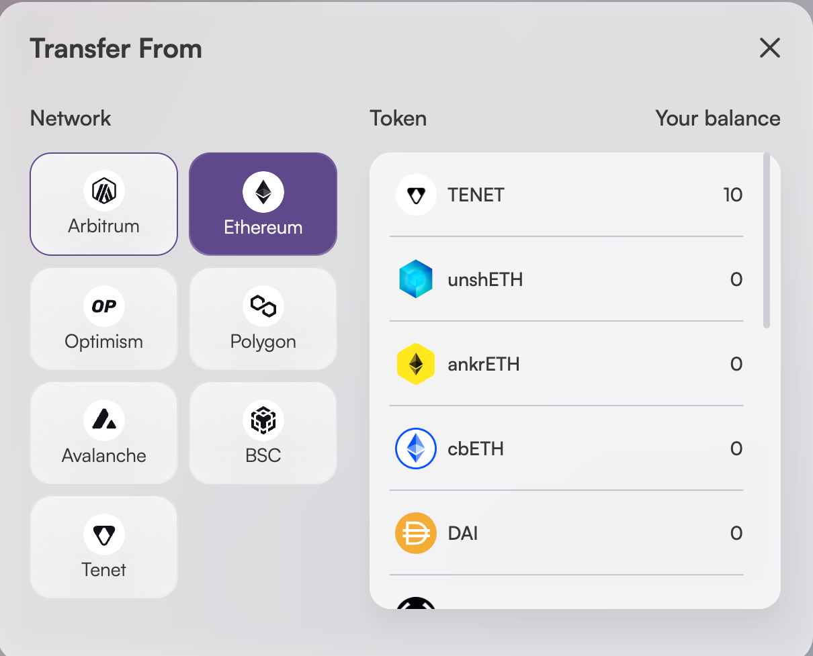

# How to Bridge
## Bridge TENET
TENET is an OFT-20 token. Thanks to Layer Zero's technology, TENET can be easily moved across many chains.

### Bridge TENET from Ethereum to Binance Smart Chain

1. Go to [https://app.tenet.org/#/bridge](https://app.tenet.org/#/bridge?from=1&to=56&token=TENET)
2. Сlick on the "Connect Wallet" button in the upper right corner and select the wallet you want to use.

3. Select the Ethereum network and TENET token in the "From" field.

4. Select the Binance Smart Chain network and TENET token in the "To" field.

5. Enter the amount of TENET you want to bridge.
6. Click on the "Bridge" button.
7. Confirm the transaction in your wallet.
8. Wait for the transaction to be confirmed.
9. Done! You have successfully bridged TENET from Ethereum to Binance Smart Chain.
