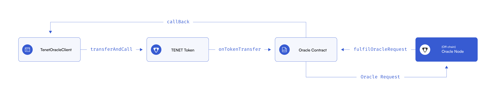

## Contracts Overview

### TenetOracleClient

[`TenetOrackeClient`] is a parent contract that enables smart contracts to consume data from oracles.

The client constructs and makes a request to a known Tenet Oracle oracle through the `transferAndCall` function, implemented by the TENET token. This request contains encoded information that is required for the cycle to succeed. In the `TenetOracleClient` contract, this call is initiated with a call to `sendTenetOracleRequestTo`.

### TENET Token

Tenet Oracle utilises an [ERC-677](https://github.com/ethereum/EIPs/issues/677) compliant version of TENET token which implements `transferAndCall`, a function that allows tokens to be transferred whilst also triggering logic in the receiving contract within a single transaction. The amount of TENET available as rewards for Tenet Oracle utilisation is set through our native gauge voting system by veTENET holders.

### Oracle Contract

[`Oracle` contracts] are owned by oracle node operators, which run alongside off-chain oracle nodes.

#### Request

The client contract that initiates this cycle must create a request with the following items:

- The oracle address.
- The job ID, so the oracle knows which tasks to perform.
- The callback function, which the oracle sends the response to.

Oracle contracts are responsible for handling on-chain requests made through the TENET token, by implementing `onTokenTransfer` as a`TenetTokenReceiver`. Upon execution of this function, the oracle contract **emits an `OracleRequest` event** containing information about the request. This event is crucial, as it is monitored by the off-chain oracle node which acts upon it.

#### Fulfillment

For fulfillment, the oracle contract has a `fulfillOracleRequest` function which is used by the node to fulfill a request once it has the result of the job. This function returns the result to the `TenetOracleClient` using the callback function defined in the original request.

### Off-Chain Oracle Node

The off-chain oracle node is responsible for listening for events emitted by its corresponding on-chain smart contract. Once it detects an `OracleRequest` event, it uses the data emitted to perform a job.

The most common job type for a Node is to make a GET request to an API, retrieve some data from it, parse the response, convert the result into blockchain compatible data, then submit it in a transaction back to the oracle contract, using the `fulfillOracleRequest` function.
